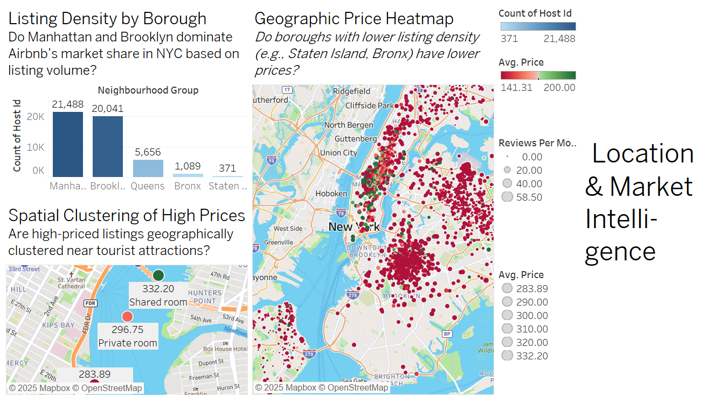
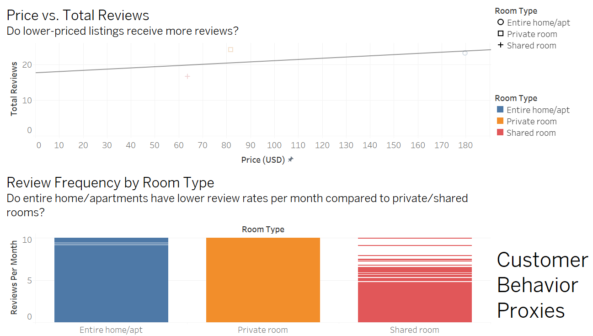
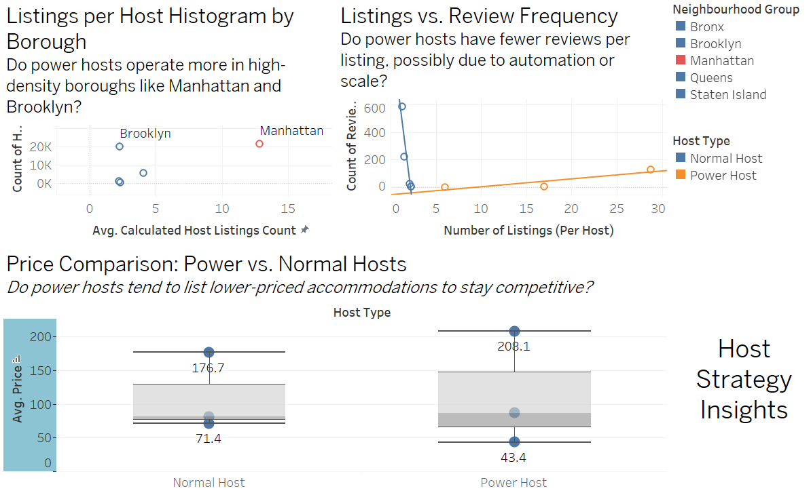
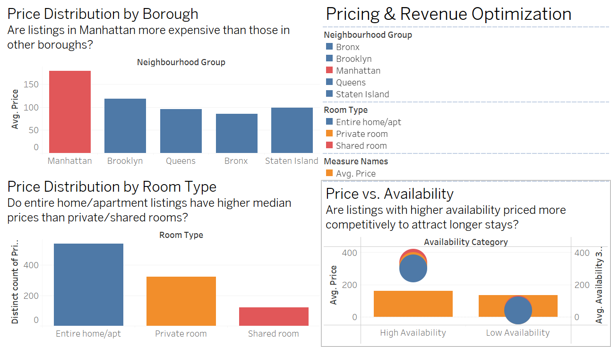

# Advanced Data Analytics – Airbnb NYC Market Intelligence

## 📌 Project Objective & Scope
This project delivers an end-to-end cloud-based advanced data analytics pipeline applied to the Airbnb NYC 2019 dataset. The objective is to extract actionable business insights related to pricing strategy, host behavior, customer engagement, and geographic demand patterns.

The project integrates multiple advanced analytics modules and demonstrates business-oriented decision support through interactive Tableau dashboards and cloud-based data processing.

---

## 🎯 Business Problem
Short-term rental platforms like Airbnb operate in highly competitive and dynamic urban markets. Hosts and platform managers require insights into:
- Optimal pricing strategies
- Location-driven demand patterns
- Host performance behavior
- Customer engagement indicators

This project addresses these decision-making challenges using real-world NYC Airbnb data.

---

## 🧠 Analytics Modules Applied
- ✔ Large-scale data processing (cloud environment)
- ✔ Machine Learning modeling
- ✔ Business Intelligence & Visualization (Tableau)
- ✔ Customer behavior analytics

---

## ☁️ Cloud-Based Implementation
All analytics workflows were executed on a cloud computing platform ensuring scalability, reproducibility, and professional deployment practices.

---

## 📊 Key Business Dashboards

### 1️⃣ Location & Market Intelligence

- Manhattan and Brooklyn dominate Airbnb listings.
- Staten Island and Bronx show lower density and lower average prices.
- Premium clusters align with tourist activity zones.

---

### 2️⃣ Customer Behavior Proxies

- Lower-priced listings receive slightly more reviews.
- Private rooms receive the highest review frequency.
- Customer engagement differs significantly by room type.

---

### 3️⃣ Host Strategy Insights

- Power hosts operate primarily in Manhattan and Brooklyn.
- Power hosts list at slightly lower average prices to remain competitive.
- High-volume hosts receive fewer reviews per listing.

---

### 4️⃣ Pricing & Revenue Optimization

- Manhattan listings command the highest average prices.
- Entire homes have the highest price distribution.
- High-availability properties are priced more competitively.

---

